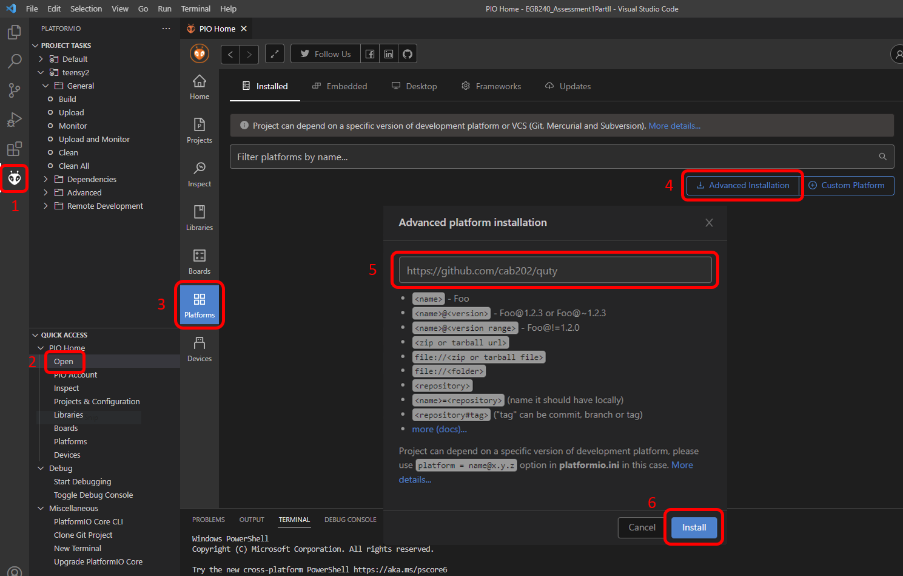

## QUTy Development Board

QUTy is a development board based on the Microchip ATtiny1626 AVR
microcontroller. It is designed specifically to teach microcontroller
programming in the course _CAB202 Microprocessors and Digital Systems_.


### Features

- Microchip ATtiny1626 microcontroller (16 KB flash, 2 KB SRAM)
- USB-C interface for power, programming (UPDI) and serial communications (UART)
- 4x pushbuttons
- Piezo buzzer
- Potentiometer
- 2-digit, 7-segment LED display
- Expansion header for socketing into a breadboard

For further detail, please refer to the [QUTy-V01 schematic](QUTy-V01_Schematic.pdf).

### Development environment

Development for the QUTy is supported via [PlatformIO](https://platformio.org/).
We recommend using the [PlatformIO IDE for VSCode](https://platformio.org/install/ide?install=vscode)
which is available for Windows, MacOS, and Linux.

#### Installation

1. Install the [Git client](https://git-scm.com/) on your system.
   For Windows users using an installer, the default options may be used.
2. Install [Visual Studio Code](https://code.visualstudio.com/download)
3. Install the [PlatformIO IDE extension](https://marketplace.visualstudio.com/items?itemName=platformio.platformio-ide) for VSCode.

4. Install the QUTy platform via:

    ```txt
    PlatformIO Home > Platforms > Advanced Installation > https://github.com/cab202/quty
    ```

    If VSCode was running during the installation of git, you may need
    to restart VSCode.

    

5. Create a PlatformIO project and configure the QUTy platform in the
   `platformio.ini`` file:

    ```ini
    [env:QUTy]
    platform = quty
    board = QUTy
    ```

    or, open an existing project by opening a directory as a workspace
    in VSCode.

    ```txt
    File > Open Folder
    ```

    Ensure that platformio.ini is present in the root of the workspace.

6. Communicating with the QUTy may require
   [Silicon Labs CP210x Virtual COM Port (VCP) drivers](https://www.silabs.com/developers/usb-to-uart-bridge-vcp-drivers)
   to be installed on your system.

#### Examples

A number of example projects are available as part of the platform.
These can be accessed via:

```txt
PlatformIO Home > Platforms > QUTy > Examples
```

- quty_blinky_c
  - 1 Hz LED flash, in C.
- quty_blinky_asm
  - 1 Hz LED flash, in Assembly.
- quty_blinky_asm_bare
  - 1 Hz LED flash, in Assembly (without startup code).
- quty_serial_helloworld
  - Serial monitor/stdio example (prints "Hello world!" on key press).

### Contact

QUTy is designed and maintained by the Queensland University of
Technology (QUT), based in Brisbane Australia. Please direct enquiries
to [cab202.enquiries@qut.edu.au](mailto:cab202.enquiries@qut.edu.au?subject=QUTy development board).

Copyright &copy; 2024 Queensland University of Technology (QUT). All rights reserved.
